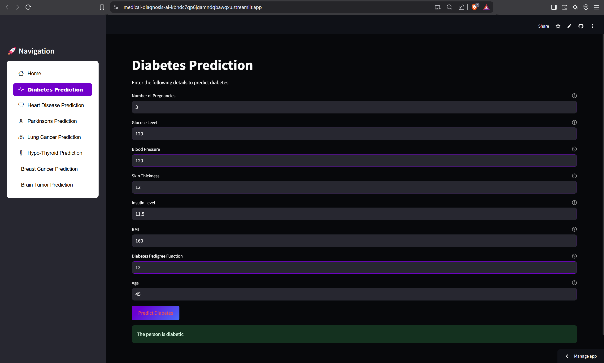
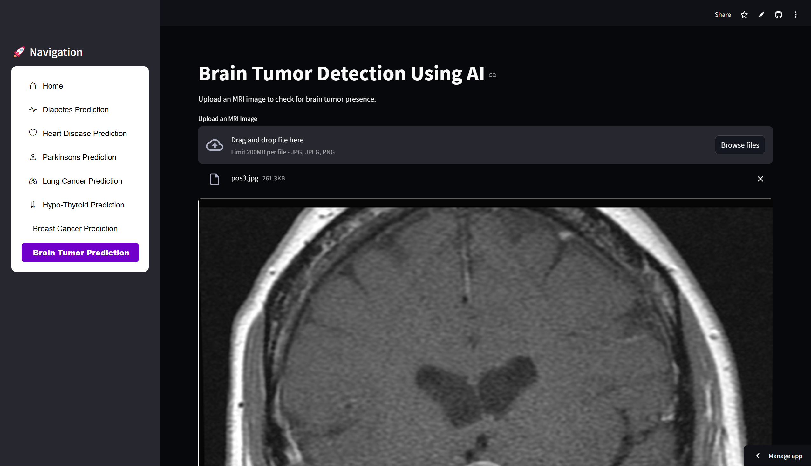
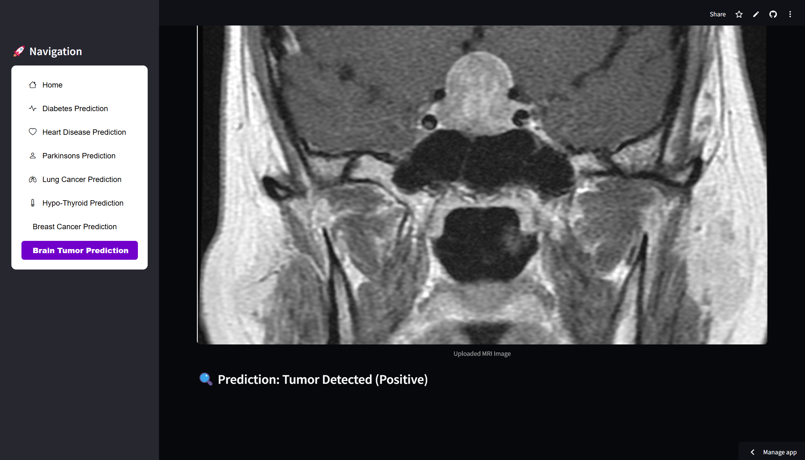

# AI-Powered Medical Diagnosis System

## 🚑 Project Overview

This project presents an AI-powered medical diagnosis platform designed to assist healthcare professionals and individuals in predicting multiple diseases using machine learning (ML) and deep learning (DL) models. The system leverages both structured clinical data and medical images for accurate predictions.

### Supported Predictions:
- 🩸 Diabetes
- ❤️ Heart Disease
- 🧠 Parkinson’s Disease
- 🫁 Lung Cancer
- 🌡️ Hypo-Thyroid
- 🎗️ Breast Cancer
- 🧠 Brain Tumor (via MRI Image Analysis)

---

## ✨ Features

- 🔄 Multi-disease prediction via a single platform
- 🖥️ Streamlit-based intuitive web app interface
- 📈 ML models for tabular data and CNN model for MRI image classification
- 🩺 Real-time AI predictions with visual feedback
- ☁️ Cloud-hosted for easy accessibility anywhere

---

## 🛠️ Tech Stack

- **Frontend:** Streamlit
- **Backend Models:**
  - ML models (Logistic Regression, Random Forest, SVM, etc.)
  - CNN (TensorFlow/Keras) for Brain Tumor Detection
- **Libraries:**
  - TensorFlow, scikit-learn, pandas, matplotlib, seaborn, OpenCV

---

## ⚙️ Installation

### Prerequisites
- Python 3.x
- pip (Python package manager)

### Clone the Repository
```bash
git clone https://github.com/rithvikchandan/medical-diagnosis-ai.git
cd medical-diagnosis-ai
```

### Install Dependencies
```bash
pip install -r requirements.txt
```

---

## ▶️ Usage

### Run the Web App
```bash
streamlit run app.py
```

Navigate via the sidebar to select diseases, input data, and view results.

---

## 🖼️ Sample Snapshots
## Snapshots

1. **Navigation Sidebar:**
   
   > Sidebar providing easy navigation across multiple disease prediction modules like Diabetes, Heart Disease, Parkinson’s, etc.

2. **Diabetes Prediction Module:**
   
   > This page contains a form where users input medical parameters for diabetes prediction using the AI model.

3. **Brain Tumor - MRI Image Upload:**
   
   > This interface allows users to upload MRI scans for brain tumor analysis.

4. **Brain Tumor - Diagnosis Result:**
   
   > The output displays the AI's diagnostic result, e.g., "Tumor Detected" or "No Tumor Detected," after analyzing the uploaded scan.

---

## 🌍 Deployment

Live App: [https://your-deployed-link.streamlit.app](https://medical-diagnosis-ai-kbhdc7qp6jgamndgbawqxu.streamlit.app/)

---

## 📈 Applications

- 🌐 Telemedicine
- 🏥 Clinics & Hospitals
- 🧑‍⚕️ AI-Assisted Healthcare Professionals
- 🏡 Remote Health Monitoring

---

## 🔮 Future Scope

- ⚙️ Integrate Grad-CAM for Explainable AI (XAI)
- 📱 Mobile app deployment
- 🔒 Federated Learning for data privacy
- 🩻 Expand to include X-Ray and CT scan diagnosis

---

## 🙌 Acknowledgements

- TensorFlow & Keras documentation
- Scikit-learn and Streamlit open-source communities
- Dataset Sources: Kaggle, UCI Machine Learning Repository

## 📜 License

This project is licensed under the [MIT License](LICENSE). You are free to use, modify, and distribute this project for both personal and commercial purposes, provided you include the original license file in your distribution.

---


---

💬 For queries, contact: **chandan.rithvik@gmail.com**

---
